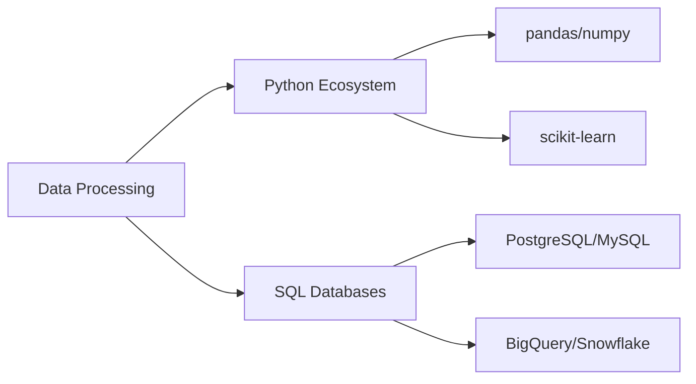

# 👋 Hello World! I'm Carla Molina

> Data-Driven UX Designer | AI Enthusiast | Digital Experience Architect

## 💡 Core Competencies

```python
class DigitalCreator:
    def __init__(self):
        self.focus_areas = ['UX/UI Design', 'Data Analytics', 'AI Integration']
        self.passion = 'Creating data-informed digital experiences'
```

## 🎯 Professional Profile

Armed with a Master's in UX/UI and specialized training in Data Analytics & AI, I bridge the gap between human-centered design and data-driven decision making. My approach combines:

- 🔬 Evidence-based design through rigorous user research
- 📊 Data analytics to validate design decisions
- 🤖 AI integration for enhanced user experiences
- 🎨 Intuitive interface design and prototyping
- 🔄 Agile methodwork in cross-functional teams

## 🛠️ Tech Arsenal

### Data Science & AI Tools


### UX/UI Toolkit
```json
{
  "design": ["Figma", "Adobe XD", "Illustrator"],
  "research": ["Optimal Workshop", "Maze", "Lookback"],
  "collaboration": ["Miro", "FigJam", "Notion"],
  "visualization": ["Tableau", "Power BI", "Matplotlib"]
}
```

## 📈 What I Bring to the Table

- Deep understanding of user behavior analytics
- Experience in creating data-driven prototypes
- Proficiency in modern design tools and frameworks
- Strong foundation in statistical analysis and ML basics
- Effective cross-functional team collaboration

## 🌐 Let's Connect!

[](https://www.linkedin.com/in/carla-molina-angel-274548283)
